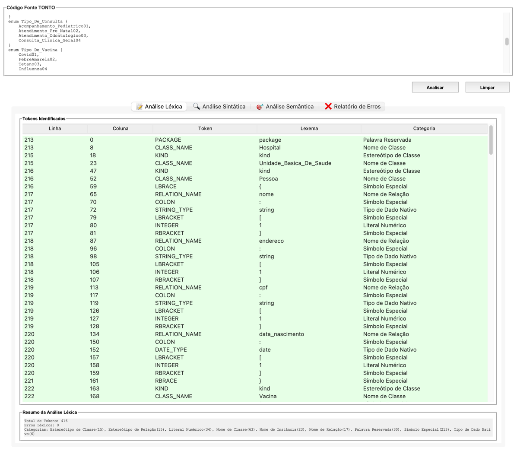
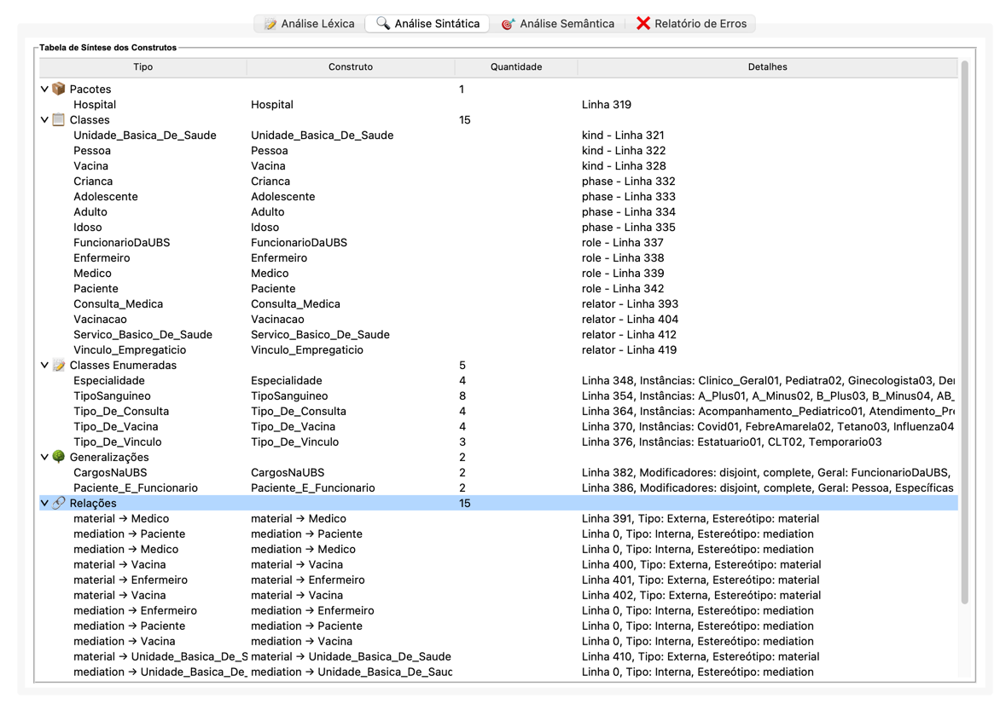
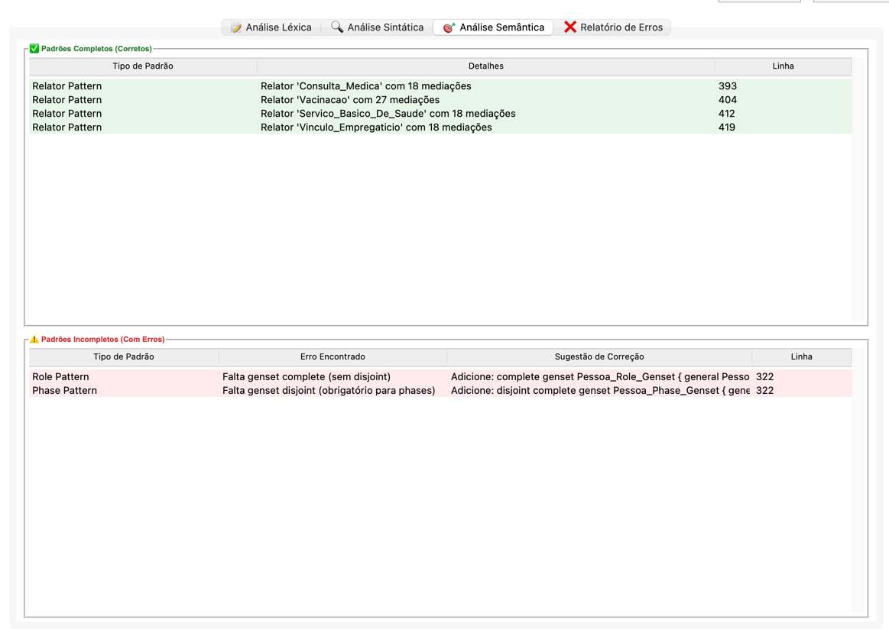
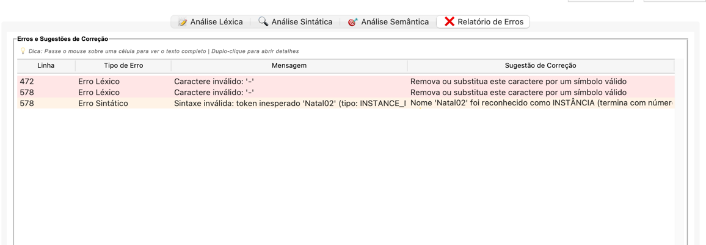
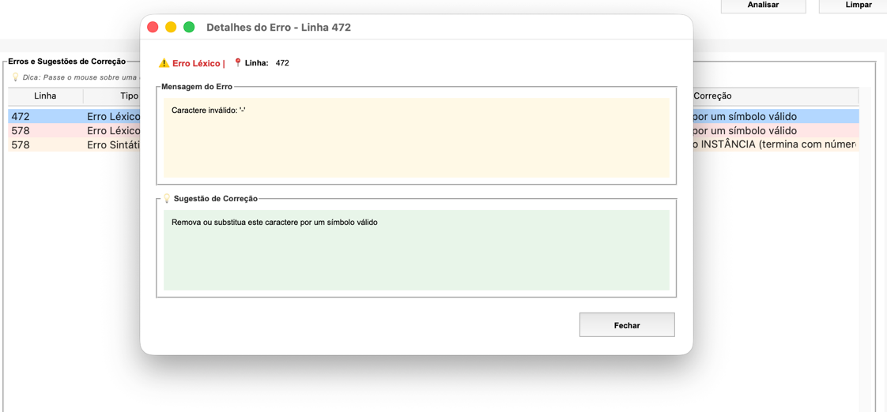

# 🎯 Analisador TONTO

Analisador completo para a linguagem TONTO (Textual Ontology Language), implementando as três fases de análise de compiladores: Léxica, Sintática e Semântica.

## 👥 Autores

- Daniel Rocha Maia
- Gabriela de Oliveira Pascoal

---

## 📋 Sobre o Projeto

Este projeto implementa um **compilador completo** para a linguagem TONTO (Textual Ontology Language), uma linguagem declarativa para especificação de ontologias baseada na OntoUML.

### Status das Fases

- ✅ **Análise Léxica** (Unidade 1)
- ✅ **Análise Sintática** (Unidade 2)
- ✅ **Análise Semântica** (Unidade 3)

---

## 🚀 Funcionalidades Principais

### 📝 Análise Léxica

- Identificação de **18 estereótipos de classe** (kind, subkind, role, phase, category, etc.)
- Identificação de **29 estereótipos de relação** (@mediation, @material, @formal, etc.)
- Reconhecimento de **palavras reservadas** da linguagem
- Validação de **nomes e identificadores** (classes, relações, instâncias)
- Detecção de **erros léxicos** com mensagens descritivas
- Classificação de tokens por categoria

### 🔍 Análise Sintática

Implementada usando **PLY (Python Lex-Yacc)**, reconhece todos os construtos da linguagem TONTO:

#### 1. Declaração de Pacotes
```tonto
package Hospital
    # declarações
```

#### 2. Declaração de Classes
```tonto
kind Person

kind Person {
    name: string
    birthdate: date [1]
}

subkind Student specializes Person
role Professor specializes Person
phase Child specializes Person

# Classes com partições
subkind Proteina of functional-complexes
```

#### 3. Declaração de Tipos de Dados
```tonto
AddressDataType {
    street: string
    city: string
    zipCode: integer
}
```

#### 4. Classes Enumeradas
```tonto
enum EyeColor {
    Blue, Green, Brown, Black
}

# Suporte a valores numéricos
enum Status {
    Active01, Inactive02
}
```

#### 5. Generalizações (Gensets)
```tonto
# Forma simples
disjoint complete genset pessoas where general Person specifics Child Adult

# Forma completa
disjoint complete genset pessoas {
    general Person
    specifics Child, Adult, Elder
}

# Modificadores suportados
disjoint | complete | overlapping | incomplete
```

#### 6. Declarações de Relações
```tonto
# Relações internas
kind University {
    componentOf <>-- Department
    @mediation [1..*] -- [1] Student
}

# Relações externas
@mediation relation employs -- EmploymentContract

# Estereótipos em linha separada
kind Hospital {
    @mediation
    [1..*] -- [1] Patient
}
```

### 🎯 Análise Semântica

**Validação de 6 Padrões de Projeto de Ontologias (ODPs):**

#### 1. **Subkind Pattern**
- **Regra:** Subkinds especializando um kind devem ter genset `disjoint complete`
- **Validação:** Verifica existência e modificadores do genset
- **Sugestão:** Gera código completo para correção

#### 2. **Role Pattern**
- **Regra:** Roles especializando um kind devem ter genset `complete` (sem disjoint)
- **Validação:** Verifica que genset não seja disjoint
- **Sugestão:** Gera genset apropriado para roles

#### 3. **Phase Pattern**
- **Regra:** Phases especializando um kind devem ter genset `disjoint` (obrigatório)
- **Validação:** Verifica modificador disjoint obrigatório
- **Sugestão:** Gera genset com disjoint para phases

#### 4. **Relator Pattern**
- **Regra:** Relator deve ter pelo menos 2 relações `@mediation`
- **Validação:** Conta mediações dentro do relator
- **Sugestão:** Indica necessidade de adicionar mediações

#### 5. **Mode Pattern**
- **Regra:** Mode deve ter `@characterization` e `@externalDependence`
- **Validação:** Verifica presença das duas relações obrigatórias
- **Sugestão:** Indica quais relações estão faltando

#### 6. **RoleMixin Pattern**
- **Regra:** RoleMixin deve ter 2+ roles e genset `disjoint complete`
- **Validação:** Verifica roles e genset apropriado
- **Sugestão:** Gera código completo para correção

---

## 🖥️ Interface Gráfica

### Visão Geral

A interface possui **4 abas principais**: Análise Léxica, Análise Sintática, Análise Semântica e Relatório de Erros.

### 1️⃣ Análise Léxica



**Características:**
- Tabela completa com todos os tokens identificados
- Colunas: Linha, Coluna, Token, Lexema, Categoria
- Cores diferenciadas para erros e tokens válidos
- Resumo estatístico com contagem por categoria

### 2️⃣ Análise Sintática



**Características:**
- Estrutura hierárquica (TreeView) de todos os construtos
- Organização por tipo: Pacotes, Classes, Tipos, Enums, Gensets, Relações
- Detalhes completos: estereótipos, linhas, modificadores
- Navegação expansível/colapsável

### 3️⃣ Análise Semântica



**Características:**
- **Seção Verde (Padrões Completos):** Padrões implementados corretamente
  - Tipo do padrão
  - Detalhes completos (classes, gensets, relações envolvidas)
  - Linha de declaração

- **Seção Vermelha (Padrões Incompletos):** Padrões com erros
  - Tipo do padrão
  - Descrição do erro encontrado
  - **Sugestão automática de correção** com código completo
  - Linha de declaração

### 4️⃣ Relatório de Erros




**Características:**
- Consolidação de erros léxicos e sintáticos
- Linha, tipo, mensagem e sugestão de correção
- Tooltips ao passar o mouse
- Duplo clique para abrir detalhes completos
- Cores diferenciadas por tipo de erro

---

## 🛠️ Tecnologias Utilizadas

| Tecnologia | Versão | Uso |
|------------|--------|-----|
| Python | 3.8+ | Linguagem principal |
| PLY | 3.11 | Parser (Lex-Yacc) |
| Tkinter | Padrão | Interface Gráfica |

**Estrutura do Projeto:**
```
analisador-sintatico/
├── src/
│   ├── lexico/
│   │   ├── __init__.py
│   │   ├── lexico.py          # Analisador léxico
│   │   └── tokens.py          # Definição de tokens
│   ├── sintatico/
│   │   ├── __init__.py
│   │   └── parser.py          # Analisador sintático (PLY)
│   ├── semantico/
│   │   ├── __init__.py
│   │   └── pattern_validator.py  # Validador de ODPs
│   └── gui/
│       ├── __init__.py
│       └── main_window.py     # Interface gráfica
├── main.py                    # Ponto de entrada
├── README.md
└── requirements.txt
```

---

## 📦 Instalação e Uso

### Pré-requisitos

- Python 3.8 ou superior
- pip (gerenciador de pacotes Python)

### Executando o Analisador

**Modo Interface Gráfica:**
```bash
python main.py
```

**Modo Linha de Comando:**
```bash
python main.py arquivo.tonto
```

### Exemplo de Uso

1. Abra o programa
2. Cole ou digite código TONTO na área de código
3. Clique em **"Analisar"** (ou pressione F5)
4. Navegue pelas abas para ver os resultados:
   - **Análise Léxica:** Tokens identificados
   - **Análise Sintática:** Estrutura do código
   - **Análise Semântica:** Validação de padrões
   - **Relatório de Erros:** Erros e sugestões

---

## 📚 Exemplos de Código TONTO

### Exemplo 1: Ontologia Hospitalar (Completa)

```tonto
package Hospital

kind Pessoa
subkind Paciente specializes Pessoa
subkind Medico specializes Pessoa

disjoint complete genset pessoas {
    general Pessoa
    specifics Paciente, Medico
}

relator Consulta {
    @mediation -- Paciente
    @mediation -- Medico
}
```

**Resultado:** ✅ Todos os padrões válidos (Subkind Pattern e Relator Pattern completos)

### Exemplo 2: Ontologia com Erro (Incompleta)

```tonto
package Universidade

kind Pessoa
role Professor specializes Pessoa
role Aluno specializes Pessoa
```

**Resultado:** ⚠️ Role Pattern incompleto - Falta genset complete
**Sugestão:** `complete genset Pessoa_Role_Genset { general Pessoa specifics Professor, Aluno }`

---

## ✨ Destaques

- Separação visual clara (verde para correto, vermelho para erros)
- **Sugestões automáticas de correção** com código completo gerado
- Código bem documentado com comentários objetivos
- Validação completa dos 6 padrões de ontologias (ODPs)
- Testado com todos os exemplos fornecidos
- Tratamento robusto de erros

---

## 📝 Limitações Conhecidas

### Hífens em Identificadores
- **Limitação:** Identificadores com hífens (ex: `Pre-Natal`) não são suportados
- **Recomendação:** Use underscores no lugar (ex: `Pre_Natal`)
- **Motivo:** Limitação do analisador léxico (conflito com operador de subtração)